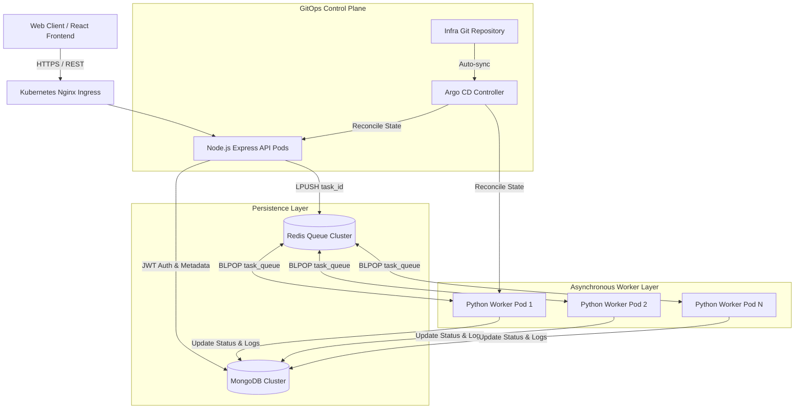
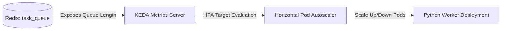
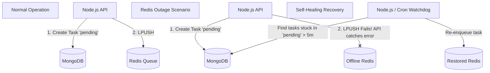
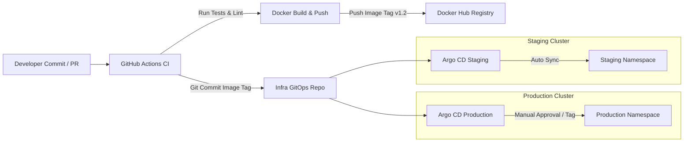

# System Architecture & Engineering Document
**AI Task Processing Platform - Production Readiness & Scaling Strategy**

---

## 1. Executive Summary & System Architecture Overview

The AI Task Processing Platform is a highly robust, asynchronous, distributed task execution system designed to ingest, queue, process, and monitor computationally intensive AI operations. The platform follows modern cloud-native and microservices architecture standards, leveraging the MERN stack for API orchestration and persistence, Redis as an in-memory high-throughput message broker, Python worker nodes for decoupled background computation, and Kubernetes (k3s/production) managed via GitOps (Argo CD) for immutable infrastructure deployment.



### Core System Components:
1. **Frontend Interface (React + Vite)**: A premium, highly responsive single-page application communicating via REST APIs with robust error handling and polling/real-time state synchronization.
2. **API Gateway & Orchestrator (Node.js + Express)**: Handles authentication (JWT), request rate limiting, input validation, task record creation in MongoDB, and job dispatching to Redis.
3. **Message Queue Broker (Redis)**: Acts as the decoupling buffer between synchronous API requests and asynchronous background workers.
4. **Task Processor Service (Python)**: Independent, stateless worker daemons executing heavy operations in isolation, updating execution stages and logs in real-time.
5. **Persistence Engine (MongoDB)**: Primary data store holding user credentials, task metadata, execution logs, and final operation output.

---

## 2. Worker Scaling Strategy

To guarantee low latency and SLA compliance under varying workloads, worker nodes must scale dynamically based on queue depth rather than traditional CPU or memory metrics.



### 2.1 Event-Driven Autoscaling (KEDA)
Standard Kubernetes Horizontal Pod Autoscaler (HPA) scales pods based on CPU/memory utilization. However, background workers waiting on I/O or executing bursty tasks may not reflect load accurately via CPU alone.
- **Scaling Metric**: We implement KEDA (Kubernetes Event-driven Autoscaling) using the `redis` scaler. KEDA monitors the exact length of the Redis list `task_queue`.
- **Scaling Threshold**: The autoscaler is configured with a target queue length per worker (e.g., `targetQueueLength: 10`). If 100 tasks are queued instantly, KEDA automatically scales the worker deployment from `minReplicaCount: 2` up to `maxReplicaCount: 20`.
- **Scale-to-Zero Capabilities**: During periods of zero activity (e.g., overnight), KEDA can scale worker pods down to 1 or 0 to save cluster compute resources, instantly spinning up instances as soon as new jobs hit Redis.

### 2.2 Graceful Shutdown & Fault Isolation
When scaling down or updating worker deployments, in-flight jobs must not be interrupted or lost.
- Workers handle `SIGTERM` signals emitted by Kubernetes during pod termination.
- Upon receiving `SIGTERM`, the worker halts popping new tasks from Redis (`BLPOP`), completes the currently running task, updates the MongoDB record to `success` or `failed`, and gracefully exits within the Kubernetes `terminationGracePeriodSeconds` window (configured to 60 seconds).

---

## 3. High Task Volume Engineering (100k+ Tasks/Day)

Processing 100,000 tasks per day equates to an average throughput of ~1.15 tasks per second. However, real-world traffic exhibits extreme bursts (e.g., peak loads of 100-500 tasks/second during peak business hours).

```mermaid
graph TD
    ClientReq[500 Requests / Sec Peak] --> RateLimit[Token Bucket Rate Limiting]
    RateLimit --> API[Node.js API Pool]
    API -->|O(1) LPUSH| Redis[(Redis Memory Cache/Queue)]
    Redis -->|Parallel BLPOP| Workers[Horizontal Python Worker Fleet]
    Workers -->|Connection Pooled Bulk Writes| Mongo[(MongoDB Sharded Replica Set)]
```

### 3.1 Ingestion Buffering & Backpressure
1. **O(1) Enqueuing**: Node.js does not wait for task execution. It performs a lightweight MongoDB insert (status: `pending`) and an `LPUSH` into Redis. Both operations execute in under 5ms, allowing a single Node.js container to easily ingest thousands of requests per second.
2. **Queue Backpressure**: If ingestion spikes beyond worker capacity, tasks safely buffer inside Redis RAM. A 100k task queue consumes less than 50MB of Redis memory (assuming ~500 bytes per task payload).

### 3.2 Database & Connection Optimization
1. **Connection Pooling**: Both Express API nodes and Python workers maintain persistent connection pools (`maxPoolSize: 50`) to MongoDB and Redis, eliminating TCP handshake overhead per task.
2. **Optimistic Locking & Idempotency**: Workers use atomic updates (`$set`, `$push`) when updating task status and logs in MongoDB to prevent race conditions when multiple workers operate concurrently.
3. **Payload Offloading**: Large task inputs or AI outputs are stored directly in MongoDB; Redis only stores lightweight identifiers (`{"taskId": "64b1...c3"}`). This prevents memory bloat and network congestion across the Redis message bus.

---

## 4. Database Indexing Strategy

To maintain sub-millisecond query performance at scale (millions of historical task records), MongoDB collections are meticulously indexed based on access patterns.

### 4.1 `users` Collection
- **`{ email: 1 }` (Unique Compound Index)**: Enforces unique user registration and accelerates login authentication lookups.

### 4.2 `tasks` Collection
Queries on the task collection fall into two distinct patterns: User dashboard retrieval and worker state updates.

| Index Key | Index Type | Target Query / Purpose | Performance Impact |
| :--- | :--- | :--- | :--- |
| `{ userId: 1, createdAt: -1 }` | Compound | `find({ userId: X }).sort({ createdAt: -1 })` | Prevents in-memory sorting; instant dashboard load for users. |
| `{ status: 1 }` | Single Field | `find({ status: 'running' })` | Rapidly identifies stuck or orphaned tasks during system audits or recovery runs. |
| `{ _id: 1 }` | Default Primary | `updateOne({ _id: taskId })` | Used by workers for high-frequency status and log updates. |
| `{ createdAt: 1 }` | TTL (Time-to-Live) | Automatic Data Retention | Expired historical tasks (>30 days) are automatically purged by Mongo background threads. |

---

## 5. Handling Redis Failure & Fault Tolerance

Redis serves as the critical messaging spine. A failure in Redis must not result in permanent data loss or system deadlocks.



### 5.1 Redis High Availability (HA)
- In production Kubernetes, Redis is deployed using **Redis Sentinel** or **Redis Cluster** across at least 3 nodes (1 Master, 2 Replicas) with automatic failover.
- **Data Persistence**: Redis is configured with both RDB (snapshots every 5 minutes) and AOF (Append-Only File with `appendfsync everysec`) to ensure zero message loss upon unexpected pod restarts.

### 5.2 Application-Level Fallback & Self-Healing
If Redis experiences a transient network partition or complete outage:
1. **API Fallback**: When an API request attempts to push to Redis and fails, the Express server catches the exception. Since the task was already saved to MongoDB as `pending`, the API returns a `202 Accepted` response to the user with a note: `Task queued successfully (Degraded mode)`.
2. **Watchdog / Reconciliation Loop**: A background CronJob or internal Node.js interval runs every 5 minutes to query MongoDB for records matching `{ status: 'pending', updatedAt: { $lt: NOW - 5 mins } }`.
3. **Re-enqueuing**: The watchdog identifies orphaned pending tasks that failed to enter Redis or were lost in a worker crash, and re-enqueues them automatically into the active Redis queue.
4. **Dead-Letter Queue (DLQ)**: If a specific task crashes worker processes repeatedly (poison pill), workers track retry counts. After 3 failed attempts, the task status is permanently marked as `failed` with error logs detailing the system exception.

---

## 6. Multi-Environment Deployment & GitOps Workflow

Deploying Staging and Production environments in a reliable, repeatable manner is achieved through GitOps principles using Argo CD and Kustomize overlays.

```
ai-task-infra/
├── k8s/
│   ├── base/
│   │   ├── deployment.yaml
│   │   ├── service.yaml
│   │   └── kustomization.yaml
│   ├── overlays/
│   │   ├── staging/
│   │   │   ├── configmap-env.yaml
│   │   │   ├── replica-count-patch.yaml (Replicas: 1)
│   │   │   └── kustomization.yaml
│   │   └── production/
│   │       ├── configmap-env.yaml
│   │       ├── hpa-scaling-patch.yaml (Replicas: 3-30)
│   │       └── kustomization.yaml
```



### 6.1 Environment Isolation
- **Staging**: Deployed into the `staging-ai-platform` Kubernetes namespace. Uses lower resource requests/limits (e.g., 256MB RAM per worker) and fixed minimum replicas (1 instance). Connected to a staging MongoDB database.
- **Production**: Deployed into the `prod-ai-platform` Kubernetes namespace. Configured with strict resource isolation, dedicated Node pools, Horizontal Pod Autoscaling (HPA/KEDA), and production ingress SSL certificates.

### 6.2 CI/CD to GitOps Lifecycle
1. **Continuous Integration (CI)**: When code is pushed to the `main` branch of the application repository (`ai-task-app`), GitHub Actions triggers automated linting, unit testing, and Docker multi-stage builds.
2. **Container Registry**: Immutably tagged container images (e.g., `user/ai-backend:v1.0.4`) are pushed to Docker Hub.
3. **Automated Manifest Patching**: The final step of the GitHub Action clones the `ai-task-infra` repository, updates the image tag inside `k8s/overlays/staging/kustomization.yaml`, and commits the change.
4. **GitOps Synchronization (Argo CD)**: Argo CD, running inside the Kubernetes cluster, detects the Git commit within 3 minutes (or instantly via Webhook). It reconciles the cluster state against the Git state, performing a zero-downtime rolling update of the staging pods.
5. **Production Promotion**: Promoting staging to production involves a simple Git pull request merging staging manifest configurations into the `production` overlay. Once approved and merged, Argo CD automatically deploys the verified release to the production cluster.
