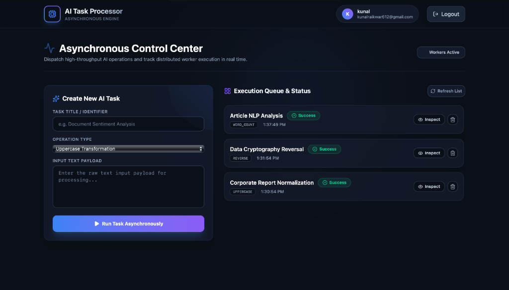

# MERN Full Stack AI Task Processing Platform



A production-grade, highly scalable asynchronous AI task execution platform built using MERN stack, Python background workers, Docker, Kubernetes, and Argo CD GitOps.

---

## 🚀 Quickstart: Local Development with Docker Compose

You can instantly spin up the entire multi-container architecture locally using Docker Compose.

### Prerequisites
- Docker & Docker Compose installed on your local machine.

### Running the Platform
1. Clone this repository and navigate to the project directory:
   ```bash
   cd /Users/kunalraikwar/Desktop/Assignment
   ```
2. Start all services in detached mode:
   ```bash
   cd ai-task-app
   docker compose up --build -d
   ```
3. Check the status of all running containers:
   ```bash
   docker compose ps
   ```

### Accessing Local Services
- **Frontend Web Application**: [http://localhost:5173](http://localhost:5173) (Premium React UI)
- **Backend API Server**: [http://localhost:5000](http://localhost:5000)
- **MongoDB Instance**: `localhost:27017`
- **Redis Instance**: `localhost:6379`

---

## 🛠️ System Architecture & Repository Structure

```
/Users/kunalraikwar/Desktop/Assignment/
├── ai-task-app/                 # Application Repository
│   ├── frontend/                # React + Vite + TailwindCSS Premium UI
│   ├── backend/                 # Node.js + Express API Orchestrator
│   ├── worker/                  # Python Asynchronous Background Job Processor
│   ├── docker-compose.yml       # Complete local Docker orchestration
│   └── .github/workflows/       # CI/CD Automated Pipelines
├── ai-task-infra/               # Infrastructure Repository (GitOps)
│   ├── k8s/                     # Kubernetes Manifests (Deployments, Services, Configs)
│   └── argocd/                  # Argo CD Application Manifests
├── ARCHITECTURE.md              # In-depth Engineering & Scaling Document (3-4 pages)
└── README.md                    # Setup & Documentation Guide
```

---

## 📦 Service Breakdown & Key Features

### 1. Frontend (React + Vite + Tailwind CSS)
- **Premium UI/UX**: Designed with modern dark-mode glassmorphism, responsive navigation grids, and status badge micro-animations.
- **JWT Auth Flow**: Secure user registration, login, and token retention.
- **Real-Time Task Monitoring**: Live status tracking grid showing `pending`, `running`, `success`, and `failed` task transitions.
- **Inspection Modal**: View detailed execution logs and operation output results instantly.

### 2. Backend API (Node.js + Express)
- **Security First**: Integrated with `bcrypt` for secure password hashing, `helmet` for HTTP header protection, and `express-rate-limit` to prevent brute force and DDoS attacks.
- **Decoupled Architecture**: Exposes REST endpoints to store initial task records in MongoDB and instantly dispatch asynchronous work to Redis. No hardcoded secrets.

### 3. Asynchronous Worker Service (Python)
- **Robust Background Processing**: Listens continuously to Redis queues (`BLPOP`).
- **Simulated AI Tasks**: Performs strings and data manipulations (`uppercase`, `lowercase`, `reverse`, `word_count`) while updating step-by-step execution logs in MongoDB.

### 4. Containerization (Docker)
- Multi-stage Dockerfiles for frontend, backend, and worker.
- All containers run as non-root unprivileged users for absolute host security.

---

## ☸️ Kubernetes & Argo CD GitOps Deployment

The entire system is packaged into Kubernetes manifests ready for deployment onto k3s, minikube, or any cloud Kubernetes cluster.

### 1. Deploying Infrastructure Manifests
To manually apply the manifests to your cluster:
```bash
kubectl apply -f ai-task-infra/k8s/namespace.yaml
kubectl apply -f ai-task-infra/k8s/configmap.yaml
kubectl apply -f ai-task-infra/k8s/secret.yaml
kubectl apply -f ai-task-infra/k8s/mongodb.yaml
kubectl apply -f ai-task-infra/k8s/redis.yaml
kubectl apply -f ai-task-infra/k8s/backend.yaml
kubectl apply -f ai-task-infra/k8s/worker.yaml
kubectl apply -f ai-task-infra/k8s/frontend.yaml
kubectl apply -f ai-task-infra/k8s/ingress.yaml
```

### 2. Argo CD GitOps Synchronization
1. Install Argo CD on your Kubernetes cluster:
   ```bash
   kubectl create namespace argocd
   kubectl apply -n argocd -f https://raw.githubusercontent.com/argoproj/argo-cd/stable/manifests/install.yaml
   ```
2. Apply the GitOps application manifest:
   ```bash
   kubectl apply -f ai-task-infra/argocd/application.yaml
   ```
3. Argo CD will automatically sync all manifests from the `ai-task-infra` repository and ensure zero-drift continuous deployment.

---

## 🛡️ Security Compliance
- **Zero Hardcoded Secrets**: All credentials injected via environment variables and Kubernetes Secrets.
- **JWT Authorization**: Strict bearer token validation on protected API endpoints.
- **Rate Limiting**: Configured to restrict abusive API request bursts.
- **Non-Root Containers**: Dockerfiles enforce `USER node` and `USER appuser` constraints.

---

## 📖 Comprehensive Architecture Document
For detailed information on worker scaling strategies (KEDA), handling 100k+ tasks/day, database indexing, Redis fault tolerance, and multi-environment GitOps pipelines, please refer to the [ARCHITECTURE.md](ARCHITECTURE.md) document.
